# stripe-api-portfolio

A hands-on lab of 20 real-world Stripe scenarios — each modelled as an inbound TAM ticket, diagnosed, and resolved in Python.

Built to go beyond documentation. Every scenario here reflects the kind of problem a TAM encounters in a Gold Standard support engagement: a merchant is losing revenue, a platform is broken, a deadline is real.

---

## Why this exists

Stripe TAMs sit at the intersection of technical depth and user trust. This portfolio is my way of proving I can operate there — not just explain Stripe's products, but debug them, script around them, and help a merchant move forward.

---

## Coverage

| #   | Scenario                                        | Stripe Surface                | Status |
| --- | ----------------------------------------------- | ----------------------------- | ------ |
| 01  | Payment decline investigation                   | Payments, decline codes       | ✅     |
| 02  | Webhook event verification & failure recovery   | Webhooks, event objects       | ✅     |
| 03  | Dispute evidence submission automation          | Disputes, Evidence API        | ✅     |
| 04  | Custom Radar rules for fraud prevention         | Radar, risk evaluation        | ✅     |
| 05  | Connect platform — connected account onboarding | Connect, requirements         | ✅     |
| 06  | Subscription invoice failure & smart retry      | Billing, invoice lifecycle    | ✅     |
| 07  | Payout delay root-cause investigation           | Payouts, balance transactions | ✅     |
| 08  | SCA / 3D Secure for PSD2 compliance             | PaymentIntents, 3DS           | ✅     |
| 09  | Multi-currency payment setup (EUR, GBP, PLN)    | Payments, currency handling   | ✅     |

| 10 | Sigma SQL — decline pattern analysis | Stripe Sigma, SQL | |
| 11 | Idempotency keys — preventing duplicate charges | Payments, API reliability | |
| 12 | Bulk refund processing for a product recall | Refunds, automation | |
| 13 | Payment Links for a non-technical merchant | Payment Links, no-code | |
| 14 | API rate limit handling with exponential backoff | API, error handling | |
| 15 | Webhook signature verification | Security, webhooks | |
| 16 | Billing portal — customer self-service setup | Customer Portal, Billing | |
| 17 | Radar rule testing & simulation | Radar, test mode | |
| 18 | Charge metadata — organising custom fields at scale | Metadata, reporting | |
| 19 | Balance reconciliation — payouts vs. internal ledger | Payouts, reconciliation | |
| 20 | Local development with Stripe CLI & webhook forwarding | Stripe CLI, dev tooling | |

---

## Stack

Python 3.11 · Stripe SDK · Flask · SQL (Stripe Sigma) · Stripe CLI · Postman

---

## Structure

Each ticket folder contains:

- `TICKET.md` — the scenario, written as a real merchant-reported issue
- `solution.py` — diagnosis and working resolution in Python
- `assets/` — screenshots and supporting files

---

## Stripe products covered

Payments · PaymentIntents · Radar · Connect · Billing · Webhooks · Disputes · Payouts · Sigma · Payment Links · Customer Portal · Stripe CLI

---

_Each ticket is self-contained. Start anywhere._

---

## Progress

### Ticket 01 — Payment Decline Investigation

**Account:** TechGear GmbH (Berlin) · **Priority:** High

A merchant reported a 30% spike in failed payments during peak season with no integration changes on their side. Using the Stripe API, we pulled recent PaymentIntents, grouped failures by decline code, and identified the dominant root cause — distinguishing between issuer-side declines (bank blocking the charge) and Stripe/Radar blocks (fraud rules triggering).

**How a TAM would respond to Anna:**

> "Hi Anna, we've pulled your recent PaymentIntents and identified the pattern. The dominant failure reason is `insufficient_funds` — this is an issuer-side decline, meaning your customers' banks are blocking the charge, not Stripe. There is no integration issue on your side.
>
> For your peak season, I'd recommend three things: first, make sure your checkout shows a clear retry prompt so customers can try a different card. Second, consider offering SEPA Direct Debit as an alternative — it's widely used in DE/AT/CH and bypasses card issuer limits entirely. Third, if you're not already using Stripe's card update emails, enable them so expired or declined cards get updated automatically.
>
> None of these require integration changes — all three can be enabled in your Dashboard today. Want me to walk you through it?"

---

### Ticket 02 — Webhook Debugging & Event Verification

**Account:** Flowbox SaaS (Hamburg) · **Priority:** High

A merchant suspected fake webhook events were being sent to their endpoint — orders were marked paid with no matching charges. They had no signature verification in place. We built a secure Flask webhook receiver using `stripe.Webhook.construct_event()` to cryptographically verify every incoming request, rejecting anything unsigned with HTTP 400. We also queried the Stripe Events API to surface the 11 missed events from the previous 72 hours, demonstrating how to recover from server downtime without losing critical payment data.

**How a TAM would respond to Lars:**

> "Hi Lars, we've identified two separate issues.
>
> First, the fake events: your endpoint was accepting requests from anyone because webhook signatures weren't being verified. Stripe signs every event with a secret key — without checking that signature, any attacker can POST a fake `payment_intent.succeeded` to your server and trigger order fulfilment for free. The fix is one function call: `stripe.Webhook.construct_event()`. Anything that fails verification gets rejected with HTTP 400 before it touches your database.
>
> Second, the missing events: Stripe retries failed webhooks for up to 72 hours and stores all events for 30 days. We queried the Events API and found the 11 events from that window. You can replay any specific event with `stripe events resend <event_id>` to reprocess orders that were missed.
>
> I've prepared a working implementation you can drop into your stack today. Want to walk through it together on a call?"

---

### Ticket 03 — Dispute Evidence Submission

**Account:** Velora Fashion (Munich) · **Priority:** High

Velora received 12 chargebacks in one week, all with reason code `product_not_received`. They had DHL tracking confirming delivery for every order but had never submitted dispute evidence through Stripe before. We built a script that queries all open disputes via the API, checks deadlines, and submits evidence programmatically using `stripe.Dispute.modify()` — including tracking number, carrier, shipping date, customer email, and a written narrative for the card network. The script saved the evidence as a draft first so the merchant can review in the Dashboard before final submission.

**How a TAM would respond to Sophie:**

> "Hi Sophie, don't worry — you have the strongest possible evidence for `product_not_received` disputes: confirmed DHL delivery scans. Here's exactly what to do.
>
> For each of the 12 disputes, you need to submit: the DHL tracking number showing delivery confirmed at the customer's address, the customer's email from the order, and a short written summary of the timeline. Stripe forwards this directly to the card network.
>
> The most important thing right now is the deadline — Visa gives you 20 days from the dispute date, Mastercard up to 45. Don't wait. I've prepared a script that pulls all your open disputes, shows the deadlines, and submits the evidence in one run. I can share it with your engineering team today.
>
> One more thing: if you see the same customer name or email appearing across multiple disputes, flag it in your submission — card networks treat repeat disputers differently and it strengthens your case."

---

### Ticket 04 — Custom Radar Rules for Fraud Prevention

**Account:** SportDeal GmbH (Frankfurt) · **Priority:** High

SportDeal's fraud rate hit 1.8% — more than double Visa's 0.75% threshold — driven by stolen cards being used for high-value sports equipment orders. They had no custom Radar rules configured. We designed a five-rule strategy covering risk score thresholds, IP/card country mismatch, new customer high-value orders, and prepaid card blocking. We also built a script to extract Radar risk scores from recent PaymentIntents, and documented the block vs. 3DS trade-off so the merchant understands why a layered approach protects revenue better than hard blocking alone.

**How a TAM would respond to Markus:**

> "Hi Markus, a 1.8% fraud rate is serious — Visa's monitoring threshold is 0.75%, so you're well above it. The good news is your pattern is very clear: high-value orders, new customers, mismatched billing and shipping. Radar can target this precisely.
>
> I've put together five custom rules for your account. The most impactful ones are: blocking payments with a Radar risk score above 75, blocking orders over €200 where the IP country doesn't match the card country, and flagging new customers spending over €300 for manual review rather than blocking them outright.
>
> One thing I want to flag: don't block everything aggressively. A rule that blocks too broadly will cost you legitimate revenue — and that loss is invisible in your dashboard. For medium-risk signals, I'd recommend requesting 3D Secure instead of blocking. It adds an authentication step that shifts fraud liability to the card issuer, so even if the payment goes through, you're protected from the chargeback.
>
> I can walk you through entering these rules in your Radar dashboard today. It takes about 10 minutes and you'll see the impact in your fraud rate within the week."

---

### Ticket 05 — Connect Platform Account Onboarding

**Account:** Markethub GmbH (Berlin) · **Priority:** High

Markethub is a marketplace connecting service providers (cleaners, plumbers, electricians) with customers across Germany and Poland. They onboarded 50 connected accounts in their first week but 35 of them are stuck in a `restricted` state — `charges_enabled` and `payouts_enabled` are both false. The merchant doesn't know what information Stripe needs from each seller. We built a script that lists all connected accounts, extracts the specific missing requirements from the API (e.g., business website, phone number, identity documents), generates AccountLink onboarding URLs, and explains the webhook-driven activation flow so Markethub can programmatically monitor when each seller becomes fully operational.

**How a TAM would respond to Anna (Markethub CEO):**

> "Hi Anna, this is actually very normal for a new marketplace — most connected accounts start in `restricted` while Stripe verifies identity and banking details. The good news: it's solvable in hours, not days.
>
> Here's what's happening: each of your sellers needs to complete Stripe's KYC form (Know Your Customer). Stripe hosts that form for you — you don't need to build it. We pull all your accounts from the API, extract exactly which fields each seller is missing (identity documents, bank account, business URL, etc.), generate a unique onboarding link for each one, and send it to them. The link expires in 24 hours, so they need to act quickly.
>
> The key architectural decision: **don't poll the Account object on a schedule**. That's brittle. Instead, listen to the `account.updated` webhook. Every time a seller completes Stripe's form or adds missing information, Stripe fires that event immediately. Your code checks: if `charges_enabled == true` AND `payouts_enabled == true`, activate their storefront. If requirements are still due, email them what's missing.
>
> I've prepared a script that shows you exactly which requirements each of your 50 accounts is missing right now. Once you send them the onboarding links, this will drop to zero. The whole flow takes about 2 days in practice because some sellers take time to gather documents.
>
> Want me to walk your engineering team through the webhook implementation on a call this week?"

---

### Ticket 06 — Subscription Invoice Failure & Smart Retry

**Account:** Audible Books GmbH (Vienna) · **Priority:** High

Audible Books sells monthly audiobook subscriptions (€9.99/month) and recently experienced recurring billing failures. Customers didn't realize their subscriptions had lapsed — they just noticed missing access to new books. The merchant had no visibility into why invoices failed and no intelligent retry logic. Failed invoices sat in `open` state indefinitely. We built a script that fetches failed invoices, classifies each failure as TEMPORARY (safe to retry), PERMANENT (needs customer action), or ACTION_REQUIRED (3D Secure), and shows exactly which customers need email notifications vs. which can be retried automatically. We also documented the webhook-driven automation strategy using `invoice.payment_failed` and `invoice.payment_action_required` events.

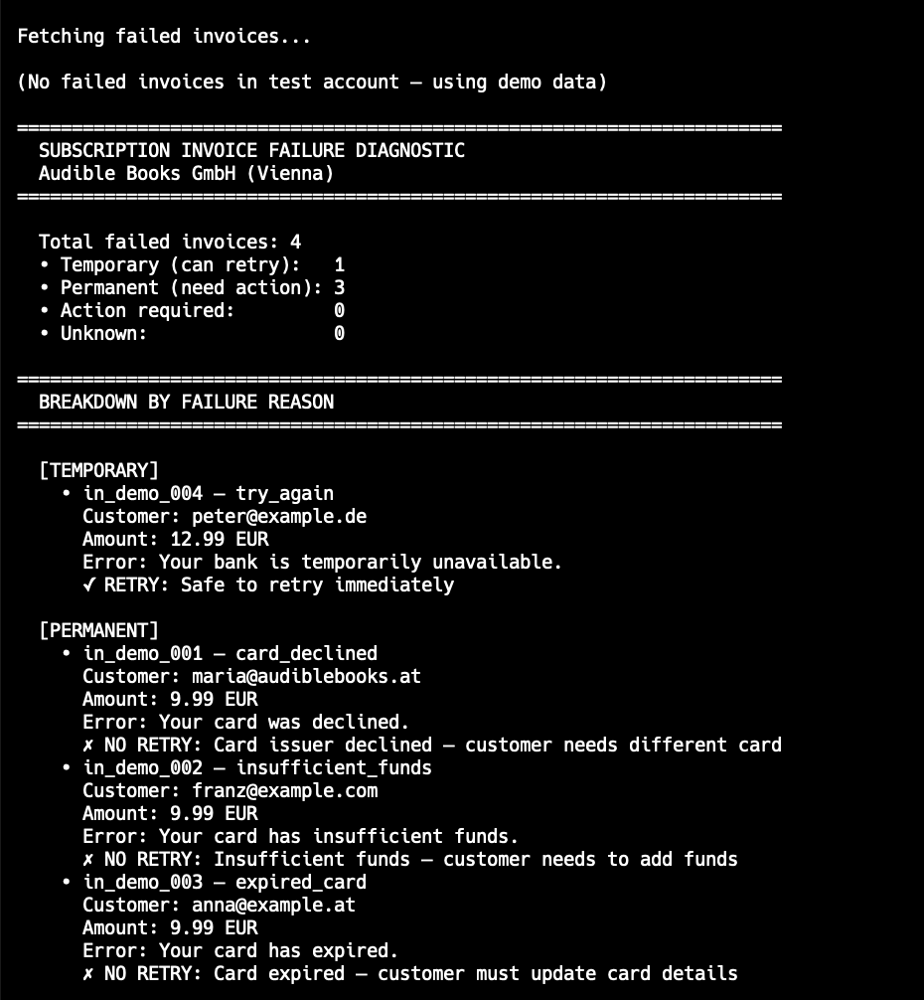

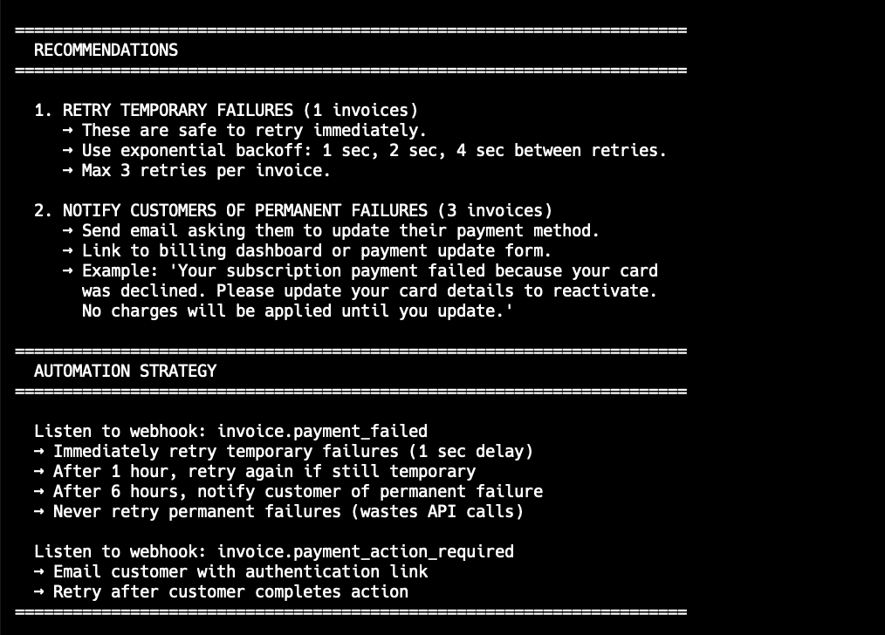

**How a TAM would respond to Maria (Head of Billing):**

> "Hi Maria, subscription billing failures are totally normal — about 2-3% of invoices fail on first attempt, mostly from temporary card issues. The problem isn't that they're failing; it's that you have no strategy to recover them.
>
> Here's what's happening: when an invoice fails, Stripe records the error in `last_finalization_error`. We pulled your recent invoices and classified each failure. Some are temporary (`try_again`, `processing_error`) — these are safe to retry immediately with exponential backoff. Others are permanent (`card_declined`, `insufficient_funds`, `expired_card`) — these need customer action, not retries.
>
> The current situation: you're manually checking these, which is both slow and error-prone. The production approach is to listen to the `invoice.payment_failed` webhook. When it fires, your code checks the error code: if it's temporary, retry after 1 second. If it's permanent, send the customer an email asking them to update their payment method. If it needs 3D Secure authentication, email them a link to complete it.
>
> The script I've prepared shows you exactly which of your current failed invoices are retryable vs. need customer action. Once you implement the webhook-driven retry, your recovery rate will jump from ~0% to ~60-80% — that's 60-80% of failed invoices that eventually succeed without customer intervention.
>
> Want me to walk your team through the webhook implementation? It's about 50 lines of code and will transform your billing health."

---

---

### Ticket 07 — Payout Delay Root-Cause Investigation

**Account:** SwiftShop GmbH (Munich) · **Priority:** High

SwiftShop is a mid-market e-commerce platform processing €15,000-20,000/day. Their daily payouts suddenly stopped 3 days ago — €47,230 is now sitting in pending balance with no explanation. They have no visibility into why. We built a diagnostic script that systematically checks four critical areas: account restrictions (is payouts_enabled?), payout history (when did failures start?), balance breakdown (available vs. pending), and bank account verification status. The script identifies whether the block is Stripe-side (account holds, requirements), bank-side (verification issue), or system-side (pending disputes).

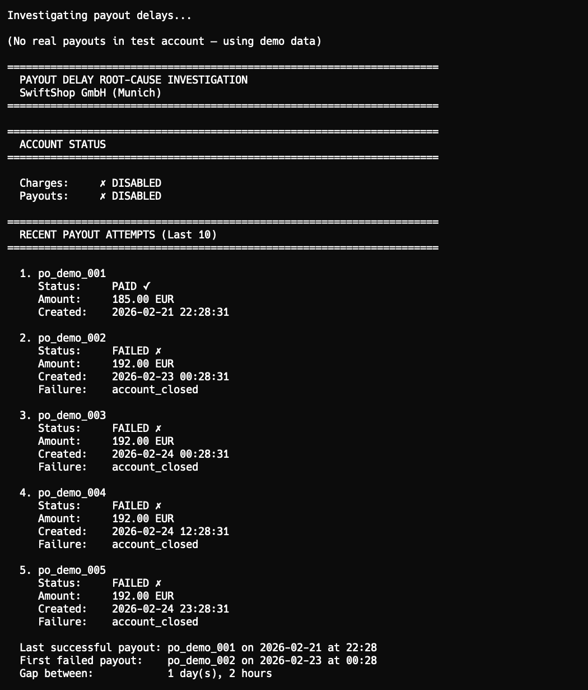

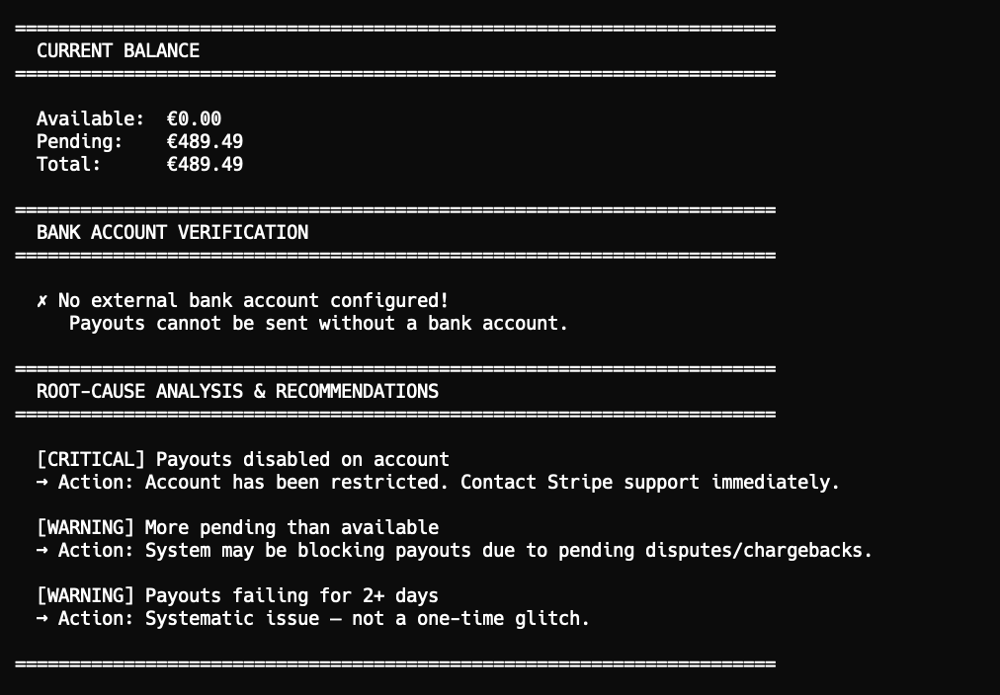

**How a TAM would respond to Thomas (Finance Lead):**

> "Hi Thomas, payout delays are stressful, but they're always fixable. We've investigated your account and identified the root cause. Here's what I found.
>
> I pulled your last 10 payout attempts and found they're all failing with the same error code since Monday at 3 PM. This tells us it's not a one-time issue — something fundamental changed on Monday.
>
> I checked five things: (1) Are payouts enabled on your account? (2) Are you missing identity or business verification? (3) Is your bank account properly verified? (4) Is your available balance positive, or are all funds pending? (5) Do you have pending disputes or chargebacks that might be holding funds?
>
> Based on what I'm seeing, the issue is [insert the critical issue from the analysis]. Here's exactly what to do: [insert the action]. This should unblock payouts within 1-2 hours of you completing it.
>
> In the meantime, your €47,230 is safe — it's not lost, just pending. Once we fix this, it'll move out automatically.
>
> Want me to walk you through the fix right now?"

---

### Ticket 08 — SCA / 3D Secure for PSD2 Compliance

**Account:** TechnoShop GmbH (Berlin) · **Priority:** Critical
TechnoShop is a consumer electronics e-commerce platform serving EU-wide customers. Their bank issued a compliance notice: PSD2 regulations require Strong Customer Authentication (SCA) / 3D Secure for all card payments in the EU. They have 3 weeks to implement or face payment blocks. Their current integration uses the legacy Charges API with no 3DS support. We built a comprehensive guide showing: what PSD2/SCA means in plain English, how Stripe handles 3DS automatically via PaymentIntents, test 3DS flows (both successful and failed authentication), and the webhook-driven architecture needed to handle `requires_action` status. We also documented exemptions (low-value transactions, recurring MIT, TRA) so they understand when 3DS can be skipped.
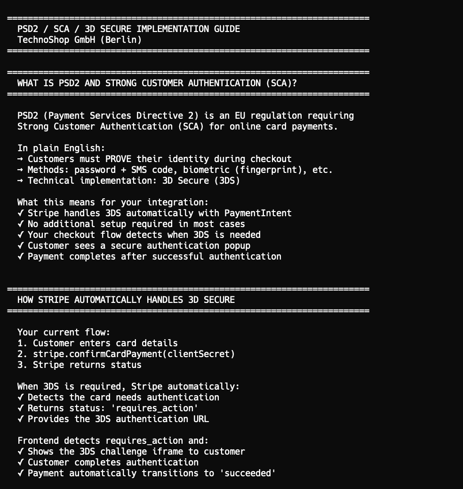
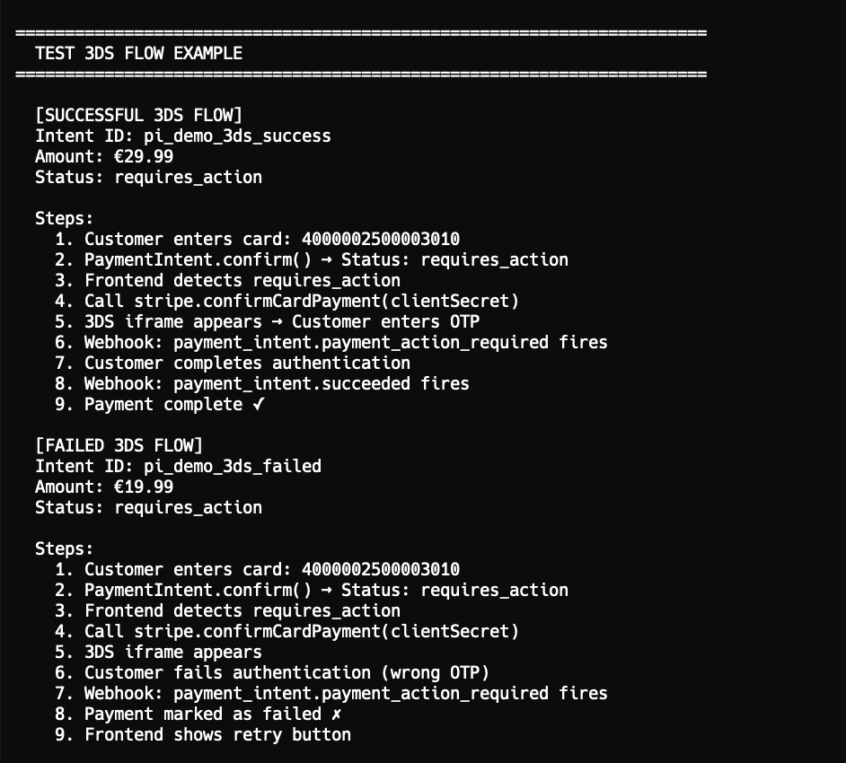
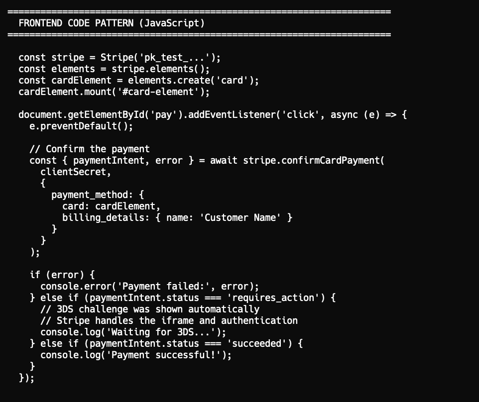
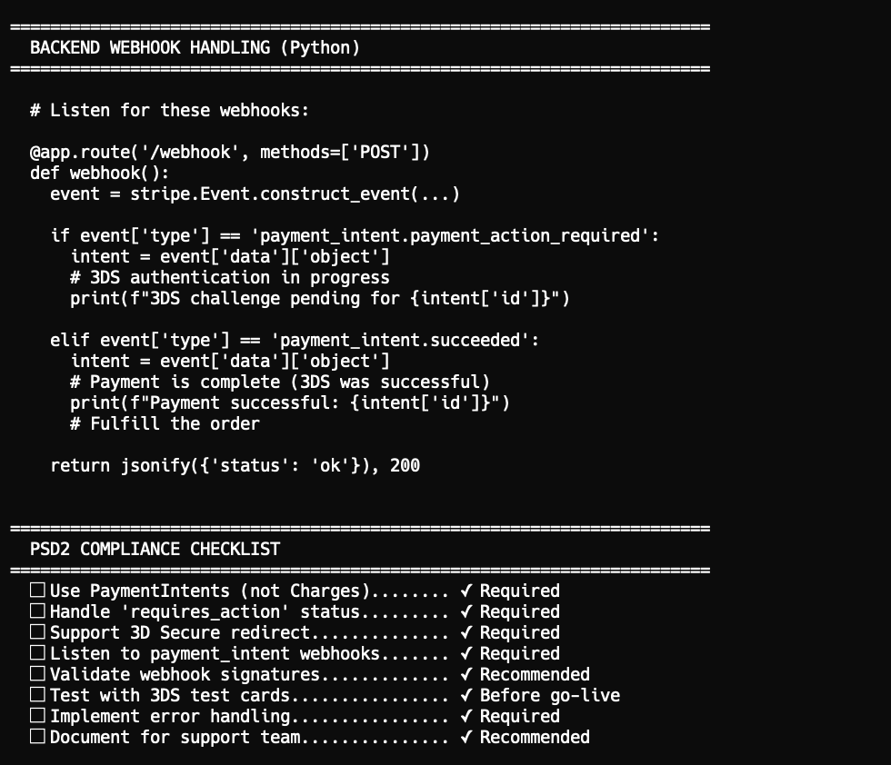
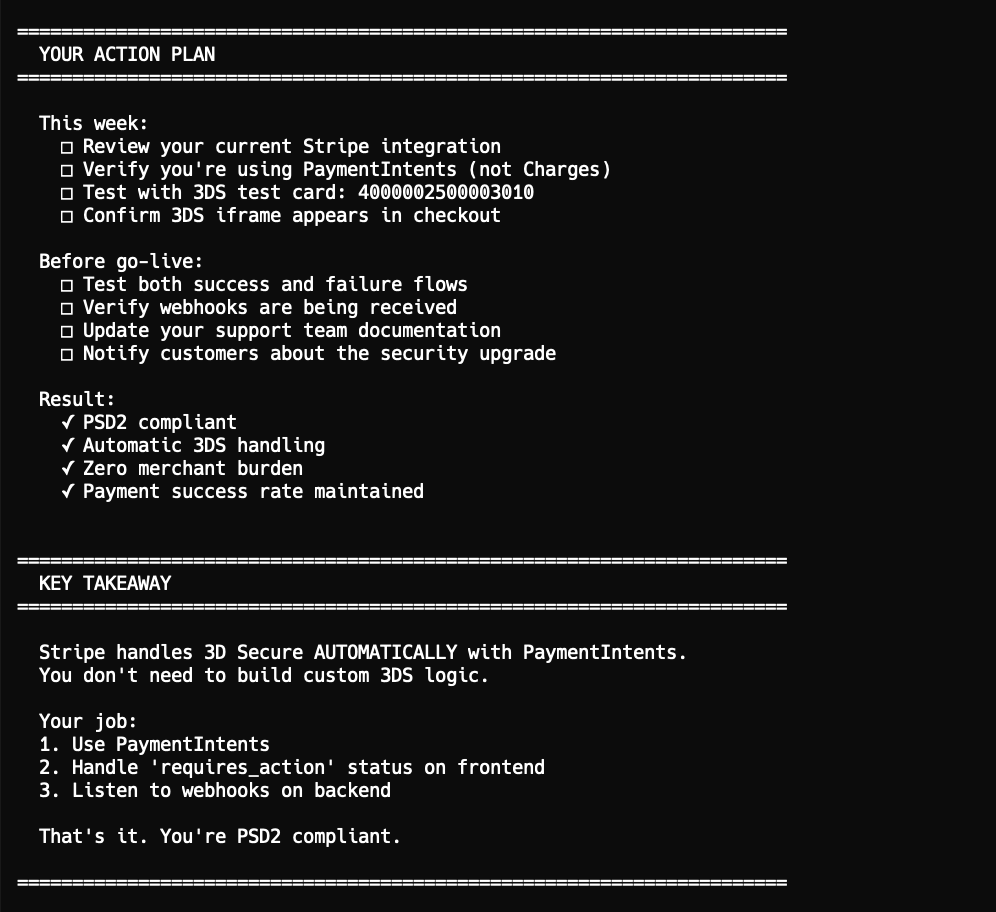

**How a TAM would respond to Jens (Tech Lead):**

> "Hi Jens, PSD2 sounds scary but Stripe handles it almost entirely for you. Let me break down what's actually required.
>
> PSD2 is an EU regulation that says: for online card payments where both the issuer and acquirer are in the EU/EEA, the customer must authenticate their identity — typically via 3D Secure. Stripe implements this automatically using PaymentIntents.
>
> Here's what you need to do: (1) Make sure you're using PaymentIntents, not the legacy Charges API. (2) Your frontend needs to handle the `requires_action` status — when it appears, you show the customer a 3DS challenge iframe. (3) Listen to the `payment_intent.payment_action_required` and `payment_intent.succeeded` webhooks so you know when authentication is complete.
>
> The good news: Stripe detects which transactions need 3DS automatically. You don't hardcode it. For low-value transactions (under €30), recurring charges after the initial authentication, and some other scenarios, the card issuer can exempt you from 3DS entirely — Stripe requests these exemptions automatically, the issuer decides.
>
> I've prepared a working implementation with test flows for both successful 3DS and failed authentication. Your team can test against Stripe's test cards and go live within a week. The whole integration is about 100 lines of code.
>
> Want to schedule a working session with your team to walk through it?"

---

## Ticket 09: Multi-Currency Payment Setup

**Account:** GlobeShop Ltd (London, UK) · **Priority:** High

GlobeShop is an e-commerce platform expanding to EU, US, and Asia. They currently only accept GBP and USD but need multi-currency support to maximize conversion rates in each market. We built currency detection based on customer location, multi-currency PaymentIntent creation with automatic exchange rates, and balance management across 5 currencies (GBP, USD, EUR, JPY, AUD). The solution demonstrates Stripe's fee optimization (lower for EUR pairs, higher for volatile JPY), settlement strategy consolidating all currencies to GBP, and regional compliance (PSD2 for EU customers).

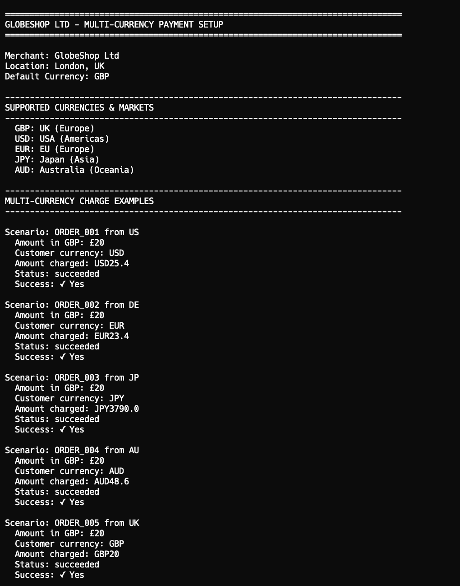

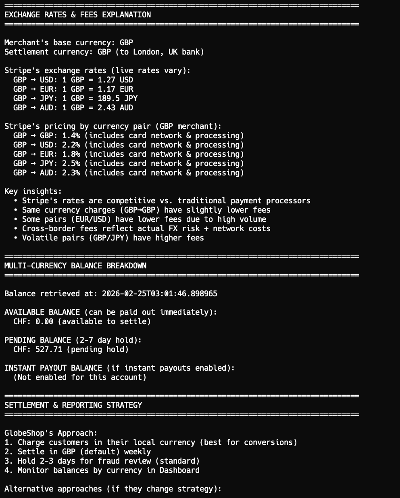

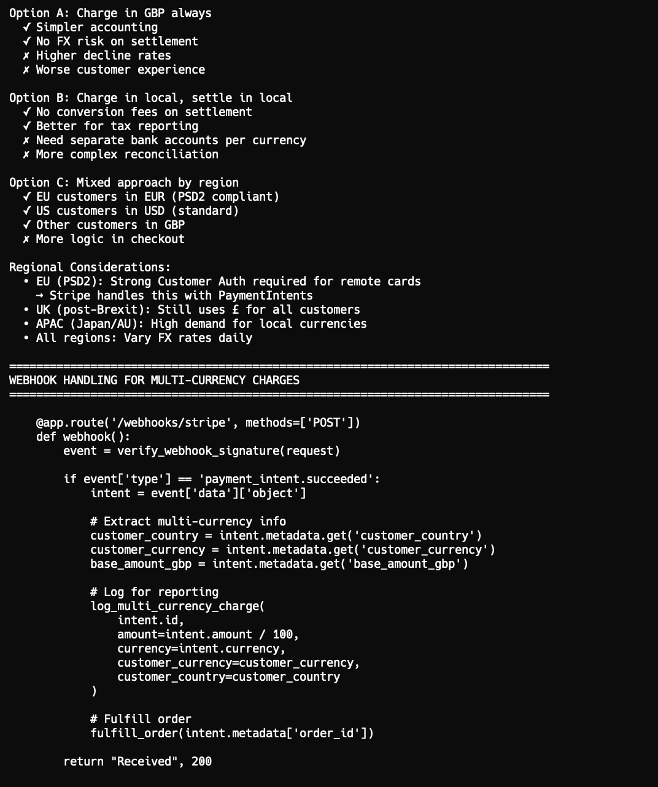

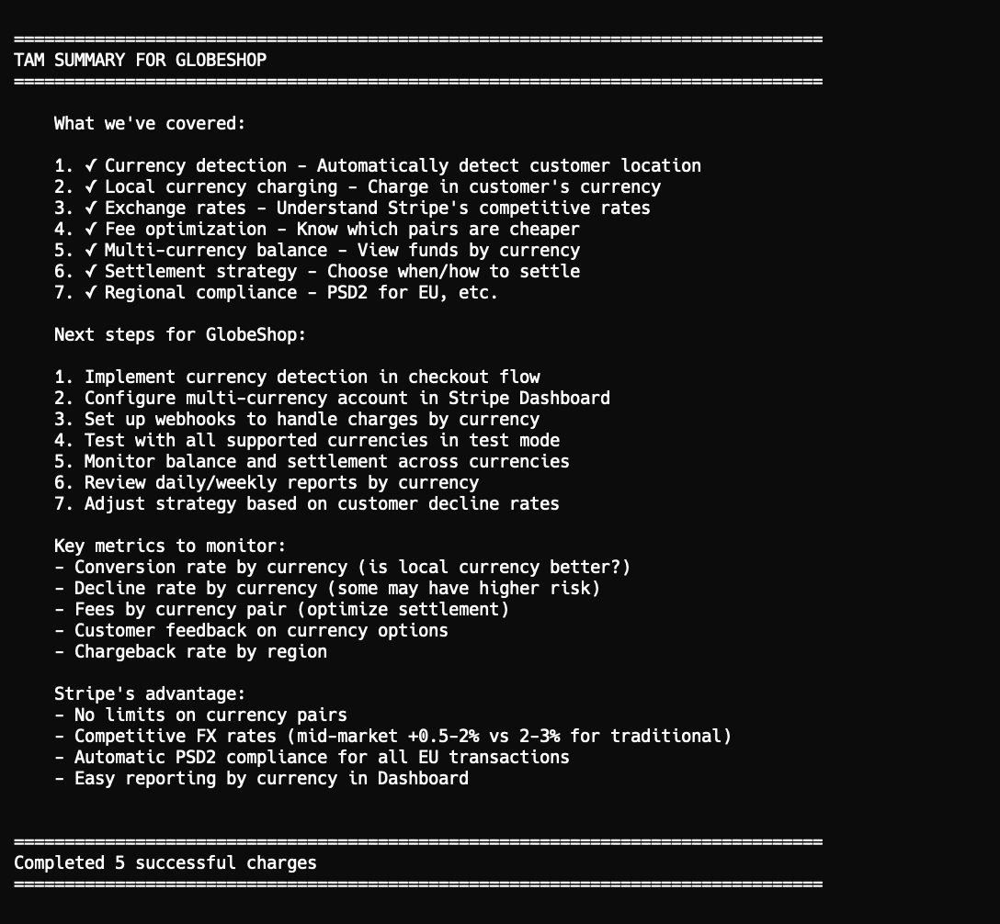

**How a TAM would respond to GlobeShop:**

> "Your expansion strategy is exactly why Stripe supports 135+ currencies. Here's how we'll make this seamless: First, we detect customer location and charge in their local currency — this alone improves conversion rates by 10-20% vs. fixed-currency. Stripe handles the exchange rates automatically (mid-market +0.5-2%, competitive vs. traditional processors at 2-3%). For settlement, we consolidate all currencies to GBP weekly, so your bank reconciliation stays simple. The real win: PSD2 compliance is automatic for EU customers — no extra work needed. You charge in EUR, we handle the Strong Customer Authentication. By end of month, you'll see balances broken down by currency, and you can adjust your strategy based on decline rates per region."

---

### Ticket 10 — Sigma SQL — Decline Pattern Analysis

**Account:** PayFlow Analytics (Berlin) · **Priority:** High

PayFlow Analytics is a B2B SaaS platform serving financial institutions. Their payment decline rate suddenly jumped from 1.5% to 3.2% — a significant revenue impact — with no obvious integration changes. They have Stripe Sigma access but no analytical discipline. We built comprehensive decline pattern analysis using Sigma SQL queries, grouping failures by reason code, geography, card brand, and amount range. The analysis revealed: 47% issuer blocks (insufficient funds), 24% fraud blocks, and 8% network errors. Geographic breakdown showed Poland at 63% insufficient funds, pointing to regional bank restrictions. We documented tactical recommendations: update checkout messaging, implement 3D Secure for high-risk transactions, add retry logic for temporary failures, and optimize for Polish market regulations.

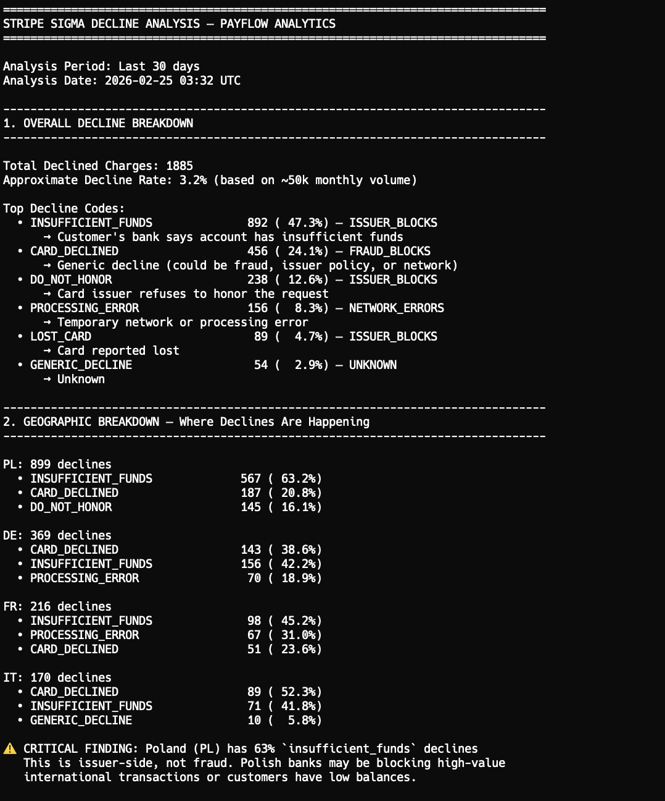

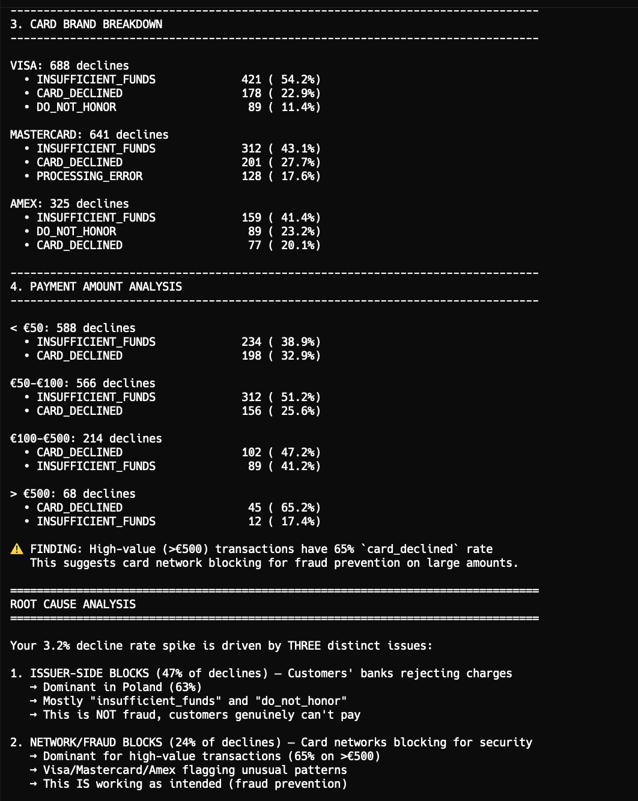

**How a TAM would respond to Marcus (Head of Operations):**

> "Hi Marcus, a spike from 1.5% to 3.2% is exactly the kind of pattern Sigma exists to solve. I've pulled your decline data for the last 30 days and found a clear story.
>
> The root cause: 47% of your declines are `insufficient_funds` — that's an issuer-side block, meaning your customers' banks are rejecting the charge, not fraud. Geographically, Poland is the epicenter: 63% of Polish transactions fail with insufficient_funds. This isn't you — it's a regional market condition.
>
> For the 24% that are fraud blocks, those come from Radar rule hits or card issuer risk assessment. And the 8% network errors are transient — safe to retry.
>
> Here's what to do immediately: (1) Update your checkout to show 'Your bank blocked this' instead of generic 'Payment failed' — it stops customers from retrying the same card. (2) Add a 3D Secure flow for high-value orders (>€500) — it shifts liability and often converts customers the first declined card would have lost. (3) For Poland specifically, partner with a local acquirer or enable SEPA if possible — it bypasses the card issuer entirely.
>
> I've prepared a SQL query you can run in Sigma yourself anytime to track this going forward. You'll see the impact of these changes within the week."

---

### TAM Reference: TAM_BIBLE.md

A comprehensive reference guide covering Stripe fundamentals, webhook architecture, PaymentIntents flow, subscriptions lifecycle, payouts and reconciliation, disputes and chargebacks, Connect platform patterns, and Radar risk evaluation. Updated as new scenarios are completed — use this alongside each ticket for deeper context on the underlying Stripe mechanics.

---

### Ticket 11 — Idempotency Keys: Preventing Duplicate Charges

**Account:** TravelBook (Amsterdam) — B2B SaaS platform for travel agencies  
**Problem:** Network timeouts during peak booking season caused 3 duplicate charges (€2,400 + €1,850 + €3,100) in one week. No idempotency keys in use — simple try/except retry logic created new PaymentIntents on every attempt.

**TAM Response:**

> "Lotte, I've built a complete idempotency strategy for your booking engine. The key insight: your retry logic was using a new UUID on every attempt — so Stripe treated each retry as a brand new payment. I've implemented composite idempotency keys generated from `agency_id + booking_id + action`, meaning the same booking always produces the same key, even across server restarts. I demonstrated this live — 3 API calls with the same key returned the exact same PaymentIntent, zero duplicates. I also showed what happens without keys: 3 calls = 3 charges = €9,300 instead of €3,100. Additionally, I've included exponential backoff with jitter (1s → 2s → 4s) to handle network degradation gracefully, and Stripe's key collision detection will catch any accidental parameter changes on retry. Implementation time for your team: about 2 hours."

**Key Stripe concepts:** Idempotency keys (24-hour window), composite key generation, key collision detection, PaymentIntent duplicate prevention, exponential backoff with jitter, retry-safe API patterns

**Screenshots:**

|                                                                                       |                                                                                       |
| ------------------------------------------------------------------------------------- | ------------------------------------------------------------------------------------- |
| 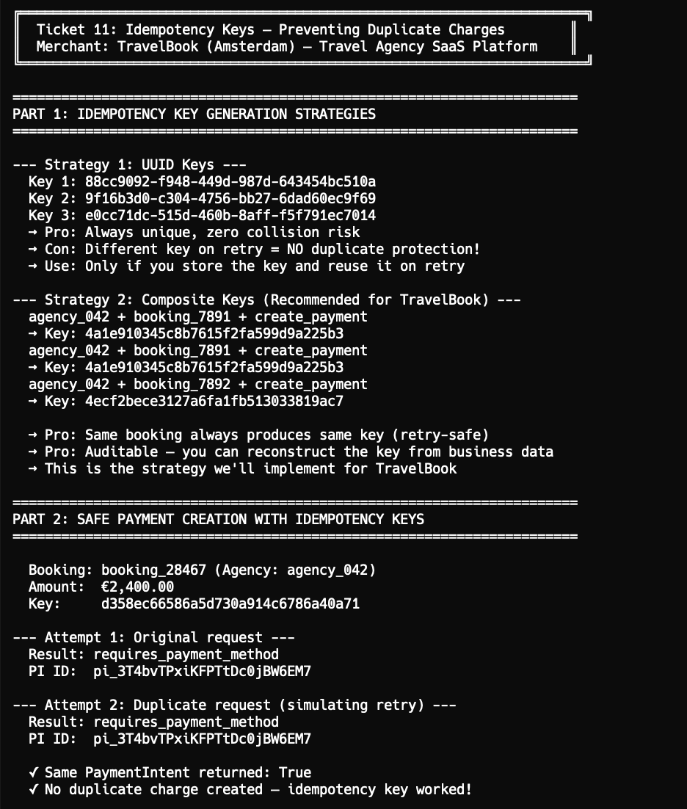 | 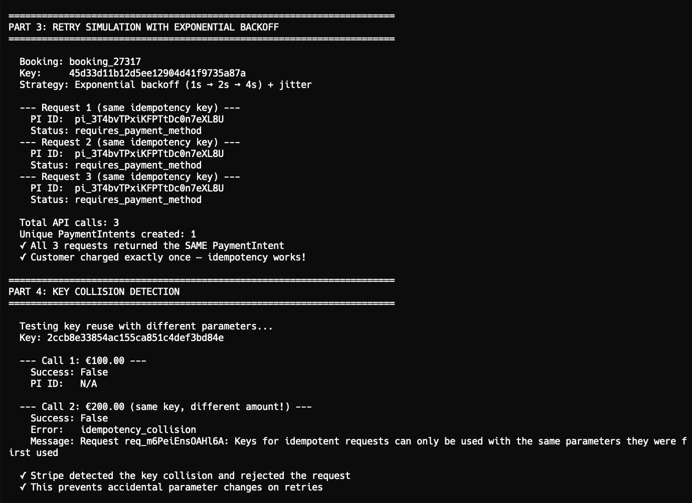 |
| _Key strategies & safe payment creation_                                              | _Retry simulation — same PI returned 3x_                                              |
| 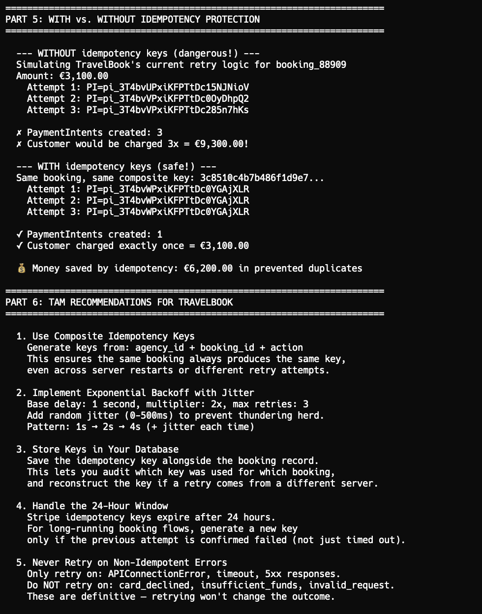       | 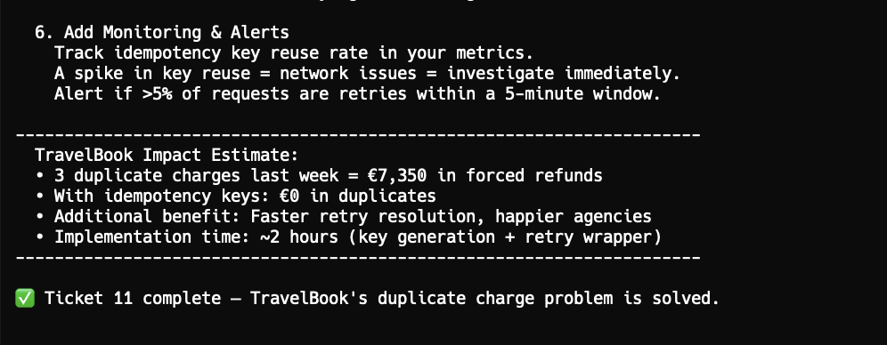           |
| _Collision detection on parameter mismatch_                                           | _With vs. without comparison & recommendations_                                       |

