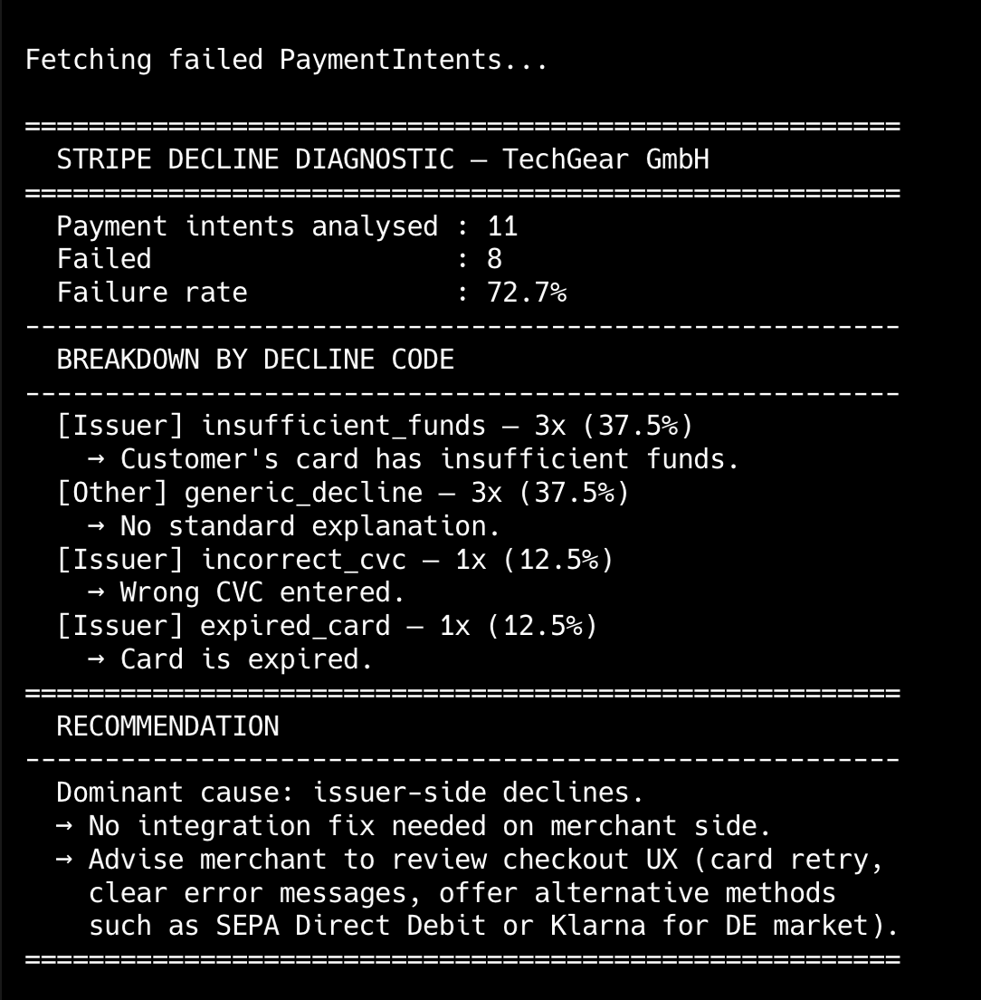
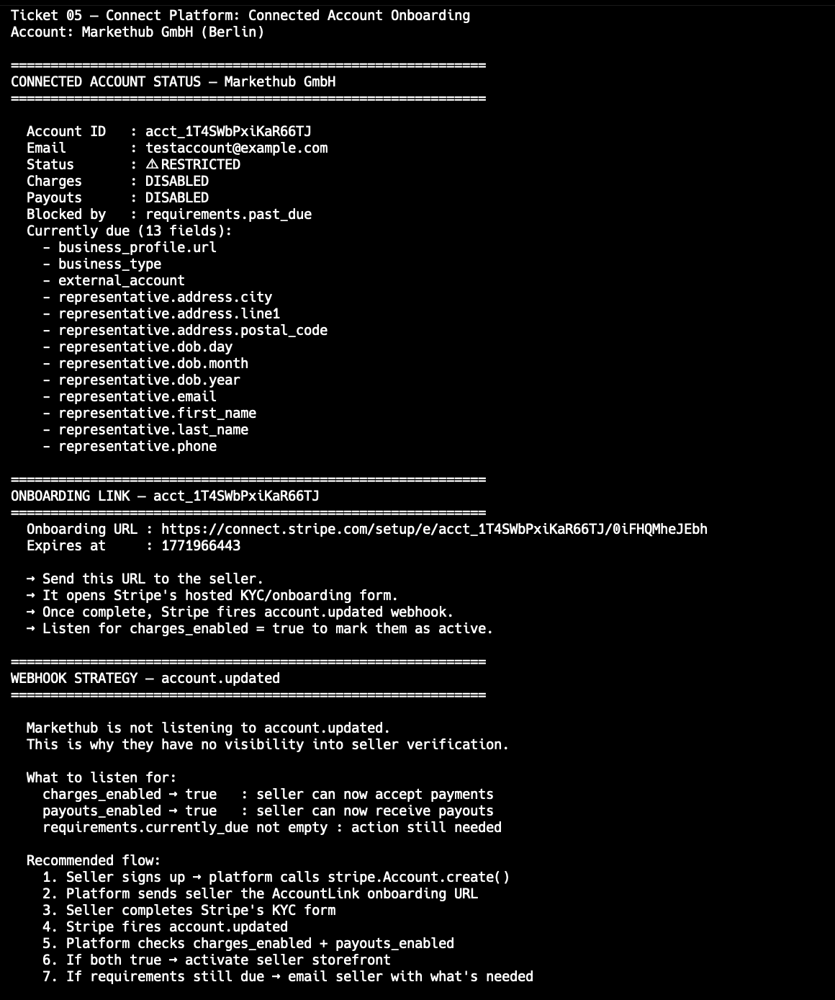

# stripe-api-portfolio

A hands-on lab of 20 real-world Stripe scenarios — each modelled as an inbound TAM ticket, diagnosed, and resolved in Python.

Built to go beyond documentation. Every scenario here reflects the kind of problem a TAM encounters in a Gold Standard support engagement: a merchant is losing revenue, a platform is broken, a deadline is real.

---

## Why this exists

Stripe TAMs sit at the intersection of technical depth and user trust. This portfolio is my way of proving I can operate there — not just explain Stripe's products, but debug them, script around them, and help a merchant move forward.

---

## Coverage

| #   | Scenario                                               | Stripe Surface                | Status |
| --- | ------------------------------------------------------ | ----------------------------- | ------ |
| 01  | Payment decline investigation                          | Payments, decline codes       | ✅     |
| 02  | Webhook event verification & failure recovery          | Webhooks, event objects       | ✅     |
| 03  | Dispute evidence submission automation                 | Disputes, Evidence API        | ✅     |
| 04  | Custom Radar rules for fraud prevention                | Radar, risk evaluation        | ✅     |
| 05  | Connect platform — connected account onboarding        | Connect, requirements         | ✅     |
| 06  | Subscription invoice failure & smart retry             | Billing, invoice lifecycle    |        |
| 07  | Payout delay root-cause investigation                  | Payouts, balance transactions |        |
| 08  | SCA / 3D Secure for PSD2 compliance                    | PaymentIntents, 3DS           |        |
| 09  | Multi-currency payment setup (EUR, GBP, PLN)           | Payments, currency handling   |        |
| 10  | Sigma SQL — decline pattern analysis                   | Stripe Sigma, SQL             |        |
| 11  | Idempotency keys — preventing duplicate charges        | Payments, API reliability     |        |
| 12  | Bulk refund processing for a product recall            | Refunds, automation           |        |
| 13  | Payment Links for a non-technical merchant             | Payment Links, no-code        |        |
| 14  | API rate limit handling with exponential backoff       | API, error handling           |        |
| 15  | Webhook signature verification                         | Security, webhooks            |        |
| 16  | Billing portal — customer self-service setup           | Customer Portal, Billing      |        |
| 17  | Radar rule testing & simulation                        | Radar, test mode              |        |
| 18  | Charge metadata — organising custom fields at scale    | Metadata, reporting           |        |
| 19  | Balance reconciliation — payouts vs. internal ledger   | Payouts, reconciliation       |        |
| 20  | Local development with Stripe CLI & webhook forwarding | Stripe CLI, dev tooling       |        |

---

## Stack

Python 3.11 · Stripe SDK · Flask · SQL (Stripe Sigma) · Stripe CLI · Postman

---

## Structure

Each ticket folder contains:

- `TICKET.md` — the scenario, written as a real merchant-reported issue
- `solution.py` — diagnosis and working resolution in Python
- `assets/` — screenshots and supporting files

---

## Stripe products covered

Payments · PaymentIntents · Radar · Connect · Billing · Webhooks · Disputes · Payouts · Sigma · Payment Links · Customer Portal · Stripe CLI

---

_Each ticket is self-contained. Start anywhere._

---

## Progress

### Ticket 01 — Payment Decline Investigation

**Account:** TechGear GmbH (Berlin) · **Priority:** High

A merchant reported a 30% spike in failed payments during peak season with no integration changes on their side. Using the Stripe API, we pulled recent PaymentIntents, grouped failures by decline code, and identified the dominant root cause — distinguishing between issuer-side declines (bank blocking the charge) and Stripe/Radar blocks (fraud rules triggering).

**How a TAM would respond to Anna:**

> "Hi Anna, we've pulled your recent PaymentIntents and identified the pattern. The dominant failure reason is `insufficient_funds` — this is an issuer-side decline, meaning your customers' banks are blocking the charge, not Stripe. There is no integration issue on your side.
>
> For your peak season, I'd recommend three things: first, make sure your checkout shows a clear retry prompt so customers can try a different card. Second, consider offering SEPA Direct Debit as an alternative — it's widely used in DE/AT/CH and bypasses card issuer limits entirely. Third, if you're not already using Stripe's card update emails, enable them so expired or declined cards get updated automatically.
>
> None of these require integration changes — all three can be enabled in your Dashboard today. Want me to walk you through it?"

---

### Ticket 02 — Webhook Debugging & Event Verification

**Account:** Flowbox SaaS (Hamburg) · **Priority:** High

A merchant suspected fake webhook events were being sent to their endpoint — orders were marked paid with no matching charges. They had no signature verification in place. We built a secure Flask webhook receiver using `stripe.Webhook.construct_event()` to cryptographically verify every incoming request, rejecting anything unsigned with HTTP 400. We also queried the Stripe Events API to surface the 11 missed events from the previous 72 hours, demonstrating how to recover from server downtime without losing critical payment data.

**How a TAM would respond to Lars:**

> "Hi Lars, we've identified two separate issues.
>
> First, the fake events: your endpoint was accepting requests from anyone because webhook signatures weren't being verified. Stripe signs every event with a secret key — without checking that signature, any attacker can POST a fake `payment_intent.succeeded` to your server and trigger order fulfilment for free. The fix is one function call: `stripe.Webhook.construct_event()`. Anything that fails verification gets rejected with HTTP 400 before it touches your database.
>
> Second, the missing events: Stripe retries failed webhooks for up to 72 hours and stores all events for 30 days. We queried the Events API and found the 11 events from that window. You can replay any specific event with `stripe events resend <event_id>` to reprocess orders that were missed.
>
> I've prepared a working implementation you can drop into your stack today. Want to walk through it together on a call?"

---

### Ticket 03 — Dispute Evidence Submission

**Account:** Velora Fashion (Munich) · **Priority:** High

Velora received 12 chargebacks in one week, all with reason code `product_not_received`. They had DHL tracking confirming delivery for every order but had never submitted dispute evidence through Stripe before. We built a script that queries all open disputes via the API, checks deadlines, and submits evidence programmatically using `stripe.Dispute.modify()` — including tracking number, carrier, shipping date, customer email, and a written narrative for the card network. The script saved the evidence as a draft first so the merchant can review in the Dashboard before final submission.

**How a TAM would respond to Sophie:**

> "Hi Sophie, don't worry — you have the strongest possible evidence for `product_not_received` disputes: confirmed DHL delivery scans. Here's exactly what to do.
>
> For each of the 12 disputes, you need to submit: the DHL tracking number showing delivery confirmed at the customer's address, the customer's email from the order, and a short written summary of the timeline. Stripe forwards this directly to the card network.
>
> The most important thing right now is the deadline — Visa gives you 20 days from the dispute date, Mastercard up to 45. Don't wait. I've prepared a script that pulls all your open disputes, shows the deadlines, and submits the evidence in one run. I can share it with your engineering team today.
>
> One more thing: if you see the same customer name or email appearing across multiple disputes, flag it in your submission — card networks treat repeat disputers differently and it strengthens your case."

---

### Ticket 04 — Custom Radar Rules for Fraud Prevention

**Account:** SportDeal GmbH (Frankfurt) · **Priority:** High

SportDeal's fraud rate hit 1.8% — more than double Visa's 0.75% threshold — driven by stolen cards being used for high-value sports equipment orders. They had no custom Radar rules configured. We designed a five-rule strategy covering risk score thresholds, IP/card country mismatch, new customer high-value orders, and prepaid card blocking. We also built a script to extract Radar risk scores from recent PaymentIntents, and documented the block vs. 3DS trade-off so the merchant understands why a layered approach protects revenue better than hard blocking alone.

**How a TAM would respond to Markus:**

> "Hi Markus, a 1.8% fraud rate is serious — Visa's monitoring threshold is 0.75%, so you're well above it. The good news is your pattern is very clear: high-value orders, new customers, mismatched billing and shipping. Radar can target this precisely.
>
> I've put together five custom rules for your account. The most impactful ones are: blocking payments with a Radar risk score above 75, blocking orders over €200 where the IP country doesn't match the card country, and flagging new customers spending over €300 for manual review rather than blocking them outright.
>
> One thing I want to flag: don't block everything aggressively. A rule that blocks too broadly will cost you legitimate revenue — and that loss is invisible in your dashboard. For medium-risk signals, I'd recommend requesting 3D Secure instead of blocking. It adds an authentication step that shifts fraud liability to the card issuer, so even if the payment goes through, you're protected from the chargeback.
>
> I can walk you through entering these rules in your Radar dashboard today. It takes about 10 minutes and you'll see the impact in your fraud rate within the week."

---

### Ticket 05 — Connect Platform Account Onboarding

**Account:** Markethub GmbH (Berlin) · **Priority:** High

Markethub is a marketplace connecting service providers (cleaners, plumbers, electricians) with customers across Germany and Poland. They onboarded 50 connected accounts in their first week but 35 of them are stuck in a `restricted` state — `charges_enabled` and `payouts_enabled` are both false. The merchant doesn't know what information Stripe needs from each seller. We built a script that lists all connected accounts, extracts the specific missing requirements from the API (e.g., business website, phone number, identity documents), generates AccountLink onboarding URLs, and explains the webhook-driven activation flow so Markethub can programmatically monitor when each seller becomes fully operational.

**How a TAM would respond to Anna (Markethub CEO):**

> "Hi Anna, this is actually very normal for a new marketplace — most connected accounts start in `restricted` while Stripe verifies identity and banking details. The good news: it's solvable in hours, not days.
>
> Here's what's happening: each of your sellers needs to complete Stripe's KYC form (Know Your Customer). Stripe hosts that form for you — you don't need to build it. We pull all your accounts from the API, extract exactly which fields each seller is missing (identity documents, bank account, business URL, etc.), generate a unique onboarding link for each one, and send it to them. The link expires in 24 hours, so they need to act quickly.
>
> The key architectural decision: **don't poll the Account object on a schedule**. That's brittle. Instead, listen to the `account.updated` webhook. Every time a seller completes Stripe's form or adds missing information, Stripe fires that event immediately. Your code checks: if `charges_enabled == true` AND `payouts_enabled == true`, activate their storefront. If requirements are still due, email them what's missing.
>
> I've prepared a script that shows you exactly which requirements each of your 50 accounts is missing right now. Once you send them the onboarding links, this will drop to zero. The whole flow takes about 2 days in practice because some sellers take time to gather documents.
>
> Want me to walk your engineering team through the webhook implementation on a call this week?"

---
