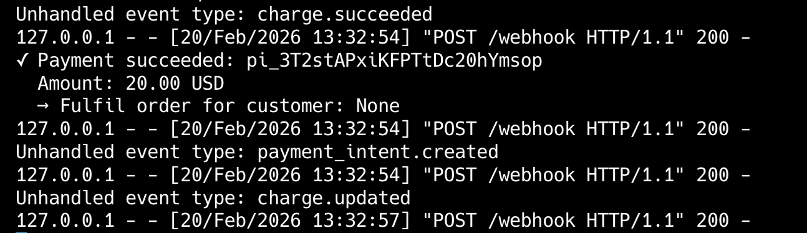

# Ticket 02 — Webhook Debugging & Event Verification

**Account:** Flowbox SaaS (Hamburg)
**Plan:** Stripe Advanced
**Reported by:** Lead Backend Engineer, Lars Hoffmann
**Priority:** High

---

## What the merchant reported

> "Our webhook endpoint has been receiving Stripe events but we've noticed
> some events seem to be missing or arriving out of order. Worse, we think
> someone may have sent fake webhook events to our endpoint last week —
> our database has orders marked as paid that we can't match to real charges.
> We need help securing our webhooks and making sure we never miss a critical
> event."

---

## What we know

- Merchant uses webhooks to fulfil orders on `payment_intent.succeeded`
- They are NOT currently verifying webhook signatures
- They have no retry handling — if their server is down, events are lost
- They process ~500 webhook events per day
- Suspected fake events were received 6 days ago

---

## Your task as TAM

1. Explain why signature verification is non-negotiable
2. Implement proper webhook signature verification using Stripe's SDK
3. Build a webhook receiver that handles the most critical payment events
4. Show how to query missed events via the Stripe Events API
5. Demonstrate how to replay missed events using the Stripe CLI

---

## Stripe concepts involved

- Webhook signatures and `Stripe-Signature` header
- `stripe.Webhook.construct_event()` for verification
- Webhook event types: `payment_intent.succeeded`, `payment_intent.payment_failed`, `charge.dispute.created`
- Event retries — Stripe retries failed webhooks for up to 3 days
- The Events API for querying past events
- `stripe listen` and `stripe trigger` via the Stripe CLI

---

## Expected output

- A secure Flask webhook receiver that rejects unverified requests
- A script to fetch and replay missed events
- Clear explanation of why unsigned webhooks are a critical security gap

---

## Output

