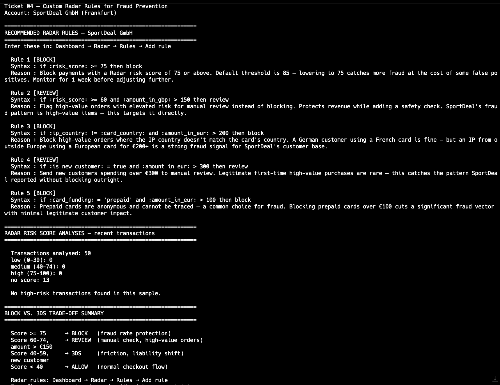

# Ticket 04 — Custom Radar Rules for Fraud Prevention

**Account:** SportDeal GmbH (Frankfurt)
**Plan:** Stripe Advanced
**Reported by:** Head of E-Commerce, Markus Steiner
**Priority:** High

---

## What the merchant reported

> "We've been seeing a wave of fraudulent orders over the last two weeks.
> High-value items — running shoes, cycling gear — being ordered with cards
> that later turn out to be stolen. Our fraud rate has jumped to 1.8% which
> is above Stripe's threshold. We need to stop the fraud without blocking
> legitimate customers. We also want to understand what Radar is already
> doing for us and where it's falling short."

---

## What we know

- Merchant sells sports equipment, average order value €220
- Fraud rate: 1.8% (Stripe threshold is typically 0.75% for Visa)
- Most fraudulent orders: high-value items, new customers, mismatched billing/shipping
- They are on Stripe Radar for Fraud Teams (advanced rules available)
- No custom Radar rules currently configured

---

## Your task as TAM

1. Explain how Stripe Radar works and what it does by default
2. Write custom Radar rules to block the highest-risk patterns
3. Show how to test rules without affecting live traffic
4. Explain the risk/conversion trade-off — blocking too aggressively hurts revenue
5. Show how to query Radar decisions via the API

---

## Stripe concepts involved

- Radar risk scores (0–100) on every PaymentIntent
- Default Radar rules vs. custom rules
- Rule syntax: `if` conditions using metadata, amount, country, card attributes
- Block, Review, Allow rule types
- 3D Secure (3DS) as a softer alternative to blocking — shifts liability
- Radar for Fraud Teams — required for custom rules
- Testing rules in test mode before going live

---

## Expected output

- A set of custom Radar rules targeting SportDeal's fraud pattern
- A script to query recent PaymentIntents and extract Radar risk scores
- Clear explanation of the block vs. 3DS trade-off

---

## Output

